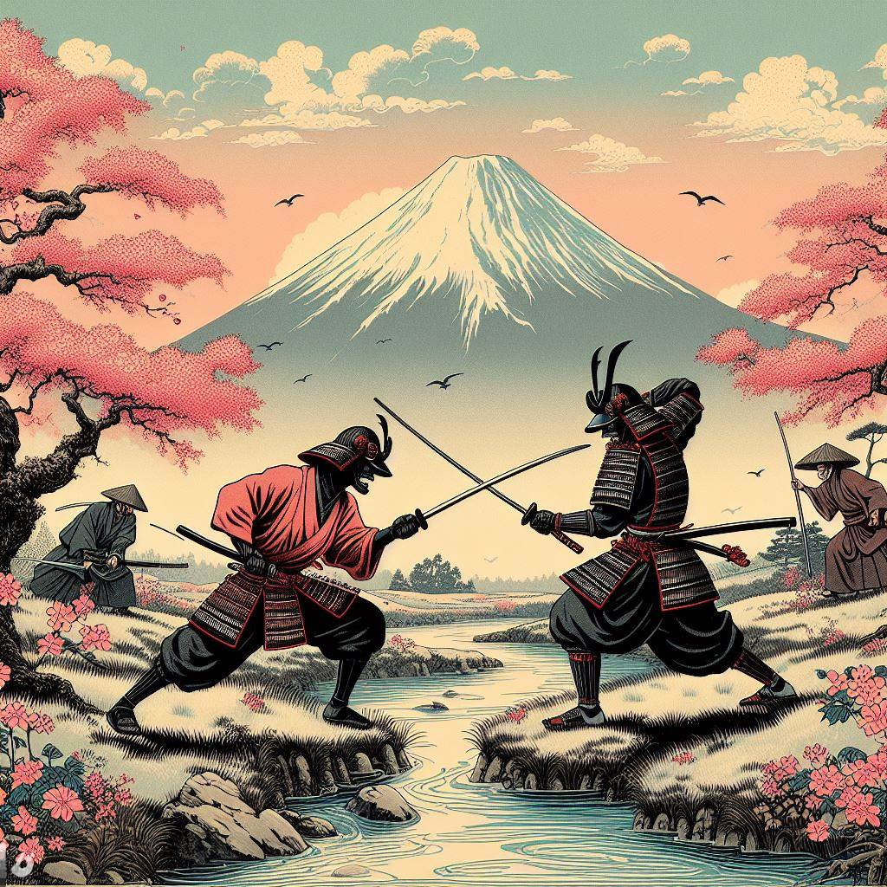

# Book of Five Rings
## A samurai duel for the Atari 2600
Inspired by the writing of Musashi Musashino, the art of Hiroshige, and of course Bushido Blade, the grandaddy of all one-hit-kill swordfighting games.

Play it in your browser:

https://javatari.org?ROM=https://github.com/dmanning23/BookOfFiveRings/releases/download/1.0/BookOfFiveRings.bin

Check the Releases page to download the latest version:

https://github.com/dmanning23/BookOfFiveRings/releases

### How to play

Put the slicey part of the katana into the opponent. 

First person to die, loses.

### Controls

| Action        | Result  |
|:------------- | -----:|
| Left      | Move left |
| Right      | Move right |
| Button | Attack |
| Up (immediately after attacking)| Cancel attack |
| Down | Block |
| Yell | KIAI! |
| Meditate | Zanshin |
| Unplug other controller | Disarm opponent |

