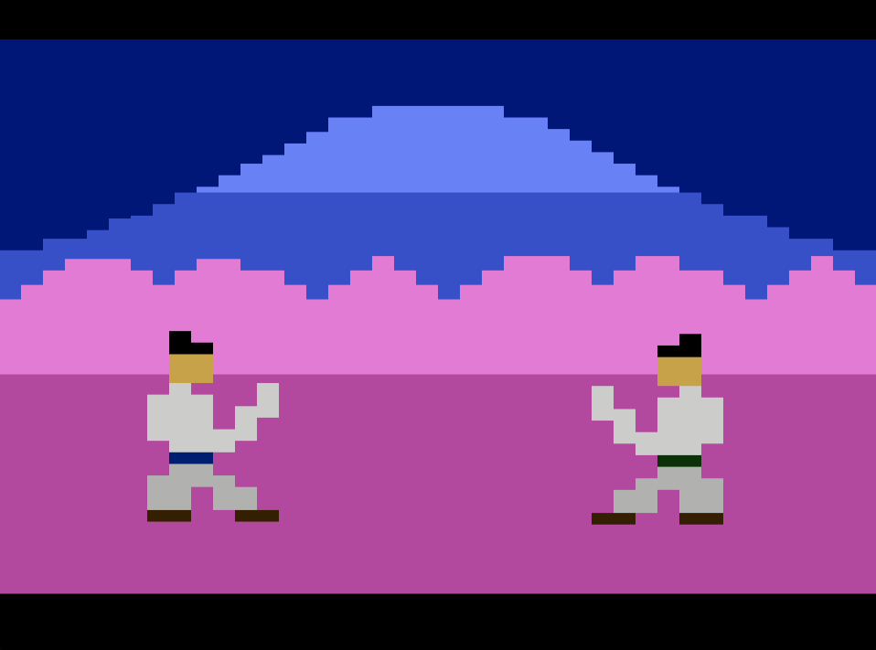

# Book of Five Rings
## A samurai duel for the Atari 2600
Inspired by the writing of Musashi Musashino, the art of Hiroshige, and of course Bushido Blade, the grandaddy of all one-hit-kill swordfighting games.

To play:

| Instruction        | Cool  |
| ------------- | -----:|
| Left      | Move left |
| Right      | Move right |
| Button | Attack |
| Up (right after attacking)| Cancel attack |
| Down | Block |
| Yell | Kiai! |

